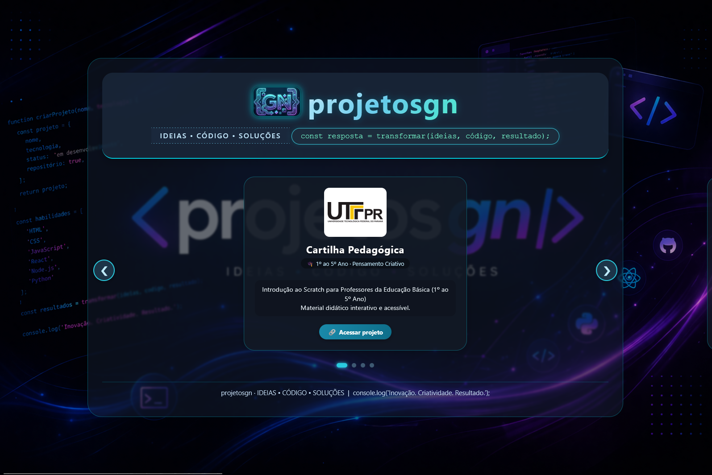

markdown

# 🚀 projetosgn · Portfólio de Soluções


> **IDEIAS • CÓDIGO • SOLUÇÕES**

---

## 📌 Sobre o Projeto

O **projetosgn** é um portfólio web moderno desenvolvido para apresentar projetos de tecnologia, inovação educacional e soluções em Business Intelligence.

Este projeto reúne iniciativas voltadas ao:
- 💡 Pensamento criativo
- 🧠 Pensamento computacional
- 🎓 Educação tecnológica
- 📊 Business Intelligence
- 🌐 Desenvolvimento web

---

## 🖥️ Preview



---

## 🧩 Funcionalidades

- 🎯 Interface moderna e intuitiva com carrossel interativo
- 📱 Responsividade (mobile-first)
- ⚡ Alto desempenho
- 🧱 Código organizado
- 🔗 Links externos seguros (abrem em nova aba)
- 🖼️ Fallback de imagens
- 👤 Página institucional "Bio" com idade calculada dinamicamente
- 🎨 Design com elementos de código estilizados

---

## 🗂️ Estrutura do Projeto

projetosgn/
│
├── index.html
├── pages/
│ └── bio.html
├── assets/
│ ├── css/
│ │ └── style.css
│ ├── js/
│ │ └── script.js
│ └── images/
text


---

## 📚 Projetos

| Projeto | Descrição |
|--------|----------|
| 🎓 Cartilha (1º ao 5º) | Introdução ao Scratch para Professores da Educação Básica |
| 🧠 Cartilha (6º ao 9º) | Sequência didática para Pensamento Computacional com Scratch |
| 👤 Bio | Página institucional com trajetória e formação de Gisele Nunes |
| 🚀 Novos Horizontes | Reservado para projetos futuros e tecnologias emergentes |

---

## 👨‍💻👩‍💻 Autoria

**Idealizadora e Criadora:** Gisele Nunes  
**Perfil profissional:** Especialista em Business Intelligence | Bacharel em Sistemas de Informação | Licencianda em Computação

📅 2026

---

## 🛠️ Tecnologias

- HTML5  
- CSS3  
- JavaScript (ES6+)  

---

## ▶️ Como Executar

```bash
git clone https://github.com/seu-usuario/projetosgn.git
cd projetosgn

Abra o arquivo:
text

index.html

Ou acesse a página institucional:
text

pages/bio.html

🌍 Deploy

    GitHub Pages

    Vercel

    Netlify

📈 Roadmap

    Modo escuro

    Filtro de projetos no carrossel

    Dashboard administrativo

    Internacionalização (i18n)

    CMS para gerenciamento de conteúdo

🤝 Contribuição

    Fork o projeto

    Crie uma branch

bash

git checkout -b feature/minha-feature

    Commit

bash

git commit -m "Minha melhoria"

    Push

bash

git push origin feature/minha-feature

    Pull Request 🚀

📄 Licença

Este projeto está sob a licença MIT.
⭐ Apoie

Se gostou, deixe uma estrela ⭐ no repositório!
💡 Frase

    “Ideias em código. Soluções em ação.”